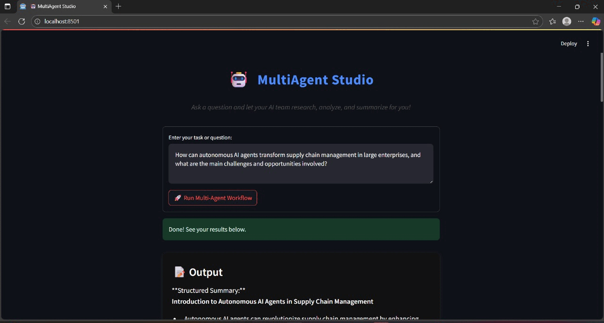

<div align="center">

# 🤖✨ MultiAgent Studio ✨🤖

**A professional multi-agent workflow system powered by LangChain, LangGraph, Groq, and Streamlit.**


</div>

---

## 🚀 Features

| 🤖 | 👥 | 🧠 | 🎨 |
|----|----|----|----|
| Planner | Researcher | Interpreter | Illustrator |

- 🧩 **Multi-Agent Workflow:** Supervisor-driven, modular agent system for research, analysis, and summarization.
- 🔗 **LangGraph Orchestration:** Uses [LangGraph](https://langchain-ai.github.io/langgraph/) for flexible, graph-based agent workflow management.
- 🖥️ **Modern Streamlit UI:** Clean, dark-themed, and responsive web app.
- 🛠️ **Easy Customization:** Modular codebase—extend or swap agents as needed.
- ⚡ **Powered by LLMs:** Uses Groq's Llama-3.1-8b-instant for fast, high-quality results.

---

## 🛠️ Setup Instructions

1. **Clone the repository**
   ```bash
   git clone https://github.com/Sampavi01/MultiAI-Skeleton.git
   cd "MultiAI Skeleton"
   ```

2. **Install dependencies**
   ```bash
   pip install -r requirements.txt
   ```

3. **Set up your environment variables**
   - Create a `.env` file in the project root.
   - Add your Groq API key:
     ```
     GROQ_API_KEY=your_groq_api_key_here
     ```

4. **Run the Streamlit app**
   ```bash
   streamlit run app.py
   ```

5. **Open your browser**
   - Go to the local URL provided by Streamlit (usually http://localhost:8501)

---

## 🗂️ Project Structure

```
MultiAI Skeleton/
│
├── app.py                   # Streamlit web app
├── multi_agent_workflow.py  # All agent logic and workflow
├── Workflow.ipynb           # Jupyter notebook: architecture, experiments, and explanations
├── images/                  # Output images and visualizations
├── requirements.txt         # Python dependencies
├── .env                     # Your API keys (not committed)
└── README.md                # This file
```

> **Note:** See `Workflow.ipynb` for a detailed, step-by-step explanation of the agent architecture, design experiments, and advanced usage examples. This notebook is your go-to reference for understanding and extending the system.

---


## 🎬 Live Demo Preview


Below is a GIF preview of the MultiAgent Studio interface showing a sample workflow and output:



---

## 📦 Dependencies

| Package         | Description                  |
|-----------------|-----------------------------|
| Streamlit       | Web app UI                  |
| LangChain       | Agent/LLM framework         |
| LangGraph       | Graph-based workflow engine |
| Groq            | LLM API                     |
| python-dotenv   | Environment variable loader |

---

## 💡 Tips

- For best results, use clear, specific questions.
- You can extend the agent logic in `multi_agent_workflow.py` for custom workflows.

---

<div align="center">
  <b>Enjoy using MultiAgent Studio! 🚀🤖</b>
</div>